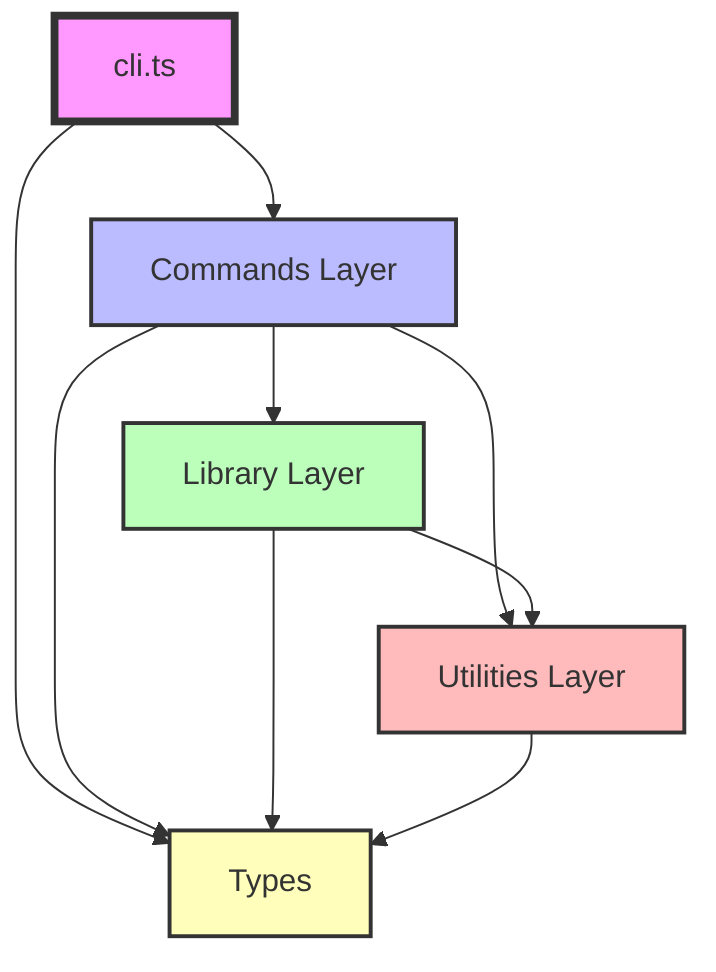

# Module Dependency Graph

**Version:** 7.0.0
**Status:** Design Phase
**Last Updated:** 2026-03-28

## Overview

This document visualizes the module dependencies in FSCR v7.0.0. Understanding the dependency graph is crucial for:
- Avoiding circular dependencies
- Optimizing bundle size
- Implementing lazy loading
- Code splitting strategies

## Dependency Rules

### Core Principles

1. **No Circular Dependencies** - Zero tolerance
2. **Unidirectional Flow** - Dependencies flow downward only
3. **Minimal Coupling** - Each module depends on as few others as possible
4. **Clear Layers** - Well-defined architectural layers

### Dependency Layers

```
┌─────────────────────────────────────────┐
│         Layer 1: CLI Entry              │  (cli.ts)
└─────────────────────────────────────────┘
                  │
                  ▼
┌─────────────────────────────────────────┐
│        Layer 2: Commands                │  (commands/)
└─────────────────────────────────────────┘
                  │
                  ▼
┌─────────────────────────────────────────┐
│     Layer 3: Core Libraries             │  (lib/)
└─────────────────────────────────────────┘
                  │
                  ▼
┌─────────────────────────────────────────┐
│        Layer 4: Utilities               │  (utils/)
└─────────────────────────────────────────┘
                  │
                  ▼
┌─────────────────────────────────────────┐
│         Layer 5: Types                  │  (types/)
└─────────────────────────────────────────┘
```

**Rule:** Higher layers can depend on lower layers, but never the reverse.

## Complete Dependency Graph

### Top-Level View



### Detailed Module Dependencies

#### CLI Entry Point

```
cli.ts
├── commander (external)
├── types/index.ts
└── Lazy loads:
    ├── commands/run.ts
    ├── commands/list.ts
    ├── commands/scripts.ts
    ├── commands/run-s.ts
    ├── commands/run-p.ts
    ├── commands/generate.ts
    ├── commands/toc.ts
    ├── commands/clear.ts
    ├── commands/completion.ts
    ├── commands/doctor.ts
    ├── commands/profile.ts
    └── commands/plugin.ts
```

#### Commands Layer

```
commands/run.ts
├── lib/config.ts
├── lib/cache.ts
├── lib/plugins.ts
├── lib/parsers/parseScriptsMd.ts
├── lib/running/runCLICommand.ts
├── utils/console.ts
└── types/index.ts

commands/list.ts
├── lib/config.ts
├── lib/cache.ts
├── lib/parsers/parseScriptsMd.ts
├── utils/console.ts
└── types/index.ts

commands/scripts.ts
├── lib/config.ts
├── lib/parsers/parsePackageJson.ts
├── utils/console.ts
└── types/index.ts

commands/run-s.ts
├── lib/config.ts
├── lib/cache.ts
├── lib/parsers/parseScriptsMd.ts
├── lib/running/runSequence.ts
├── utils/console.ts
└── types/index.ts

commands/run-p.ts
├── lib/config.ts
├── lib/cache.ts
├── lib/parsers/parseScriptsMd.ts
├── lib/running/runParallel.ts
├── utils/console.ts
└── types/index.ts

commands/generate.ts
├── lib/config.ts
├── lib/parsers/parsePackageJson.ts
├── utils/console.ts
└── types/index.ts

commands/toc.ts
├── lib/config.ts
├── utils/console.ts
└── types/index.ts

commands/clear.ts
├── lib/config.ts
├── utils/console.ts
└── types/index.ts

commands/completion.ts
├── lib/config.ts
├── lib/cache.ts
├── utils/console.ts
└── types/index.ts

commands/doctor.ts
├── lib/config.ts
├── lib/cache.ts
├── utils/console.ts
└── types/index.ts

commands/profile.ts
├── lib/config.ts
├── utils/console.ts
└── types/index.ts

commands/plugin.ts
├── lib/config.ts
├── lib/plugins.ts
├── utils/console.ts
└── types/index.ts
```

#### Library Layer

```
lib/config.ts
├── fs/promises (Node.js)
├── path (Node.js)
├── utils/package.ts
└── types/index.ts

lib/cache.ts
├── fs (Node.js)
└── types/index.ts

lib/plugins.ts
├── fs/promises (Node.js)
├── path (Node.js)
├── lib/config.ts
├── lib/cache.ts
├── utils/console.ts
└── types/index.ts

lib/parsers/parseScriptsMd.ts
├── fs/promises (Node.js)
├── readline (Node.js)
├── utils/script-parser.ts
└── types/index.ts

lib/parsers/parsePackageJson.ts
├── fs/promises (Node.js)
├── utils/package.ts
└── types/index.ts

lib/running/runCLICommand.ts
├── child_process (Node.js)
├── cross-spawn (external)
├── utils/console.ts
└── types/index.ts

lib/running/runSequence.ts
├── lib/running/runCLICommand.ts
├── utils/console.ts
└── types/index.ts

lib/running/runParallel.ts
├── lib/running/runCLICommand.ts
├── utils/console.ts
└── types/index.ts
```

#### Utilities Layer

```
utils/console.ts
├── chalk (external)
└── types/index.ts

utils/script-parser.ts
└── types/index.ts

utils/package.ts
├── fs/promises (Node.js)
└── types/index.ts
```

#### Types Layer

```
types/index.ts
└── (no dependencies - leaf node)
```

## Dependency Matrix

| Module | CLI | Commands | Lib | Utils | Types | External |
|--------|-----|----------|-----|-------|-------|----------|
| **cli.ts** | - | Lazy | ❌ | ❌ | ✅ | commander |
| **commands/** | ❌ | ❌ | ✅ | ✅ | ✅ | ❌ |
| **lib/** | ❌ | ❌ | Same layer | ✅ | ✅ | Some |
| **utils/** | ❌ | ❌ | ❌ | ❌ | ✅ | Some |
| **types/** | ❌ | ❌ | ❌ | ❌ | - | ❌ |

✅ = Allowed
❌ = Not allowed
"Lazy" = Dynamic import only
"Same layer" = Can depend on other modules in same layer

## Circular Dependency Prevention

### Detection

```bash
# Install madge
npm install -D madge

# Check for circular dependencies
npx madge --circular --extensions ts src/

# Visualize dependencies
npx madge --image deps.svg src/
```

### Validation in CI

```yaml
# .github/workflows/ci.yml
- name: Check circular dependencies
  run: |
    npx madge --circular --extensions ts src/
    if [ $? -ne 0 ]; then
      echo "Circular dependencies detected!"
      exit 1
    fi
```

### Rules

1. **Types are always leaf nodes** - Never import anything
2. **Utils never import from lib/** - Only types
3. **Commands never import from cli.ts** - One-way flow
4. **Same-layer imports are allowed** - But must not create cycles

## Bundle Size by Module

### Expected Sizes

```
Total: ~1.2MB

Breakdown:
├── cli.ts                    ~10KB
├── commands/                 ~250KB
│   ├── run.ts               ~35KB
│   ├── list.ts              ~25KB
│   ├── generate.ts          ~40KB
│   ├── doctor.ts            ~60KB
│   ├── completion.ts        ~50KB
│   └── others               ~40KB
├── lib/                      ~400KB
│   ├── config.ts            ~45KB
│   ├── cache.ts             ~35KB
│   ├── plugins.ts           ~80KB
│   ├── parsers/             ~120KB
│   └── running/             ~120KB
├── utils/                    ~80KB
│   ├── console.ts           ~40KB
│   ├── script-parser.ts     ~25KB
│   └── package.ts           ~15KB
├── types/                    ~10KB
└── node_modules/             ~450KB
    ├── commander            ~120KB
    ├── chalk                ~80KB
    ├── enquirer             ~140KB
    └── cross-spawn          ~110KB
```

## Lazy Loading Strategy

### Always Lazy Load

These modules are **always** dynamically imported:

```typescript
// Commands (loaded on demand)
const loadCommand = (name: string) => import(`./commands/${name}.js`);

// Plugins (loaded on demand)
const loadPlugin = (path: string) => import(path);
```

### Never Lazy Load

These modules are **always** statically imported:

```typescript
// Types (zero runtime cost)
import type { Script, Command } from './types/index.js';

// Core utilities (small, frequently used)
import { formatDuration } from './utils/console.js';
```

### Conditionally Lazy Load

These modules are lazy loaded based on usage:

```typescript
// Config (cache to avoid repeated loading)
let _configManager: ConfigManager | null = null;

export async function getConfigManager(): Promise<ConfigManager> {
  if (!_configManager) {
    const { ConfigManager } = await import('./lib/config.js');
    _configManager = new ConfigManager();
  }
  return _configManager;
}

// Parsers (only when needed)
export async function parseScripts(file: string): Promise<ScriptsMap> {
  if (file.endsWith('.md')) {
    const { parseScriptsMd } = await import('./lib/parsers/parseScriptsMd.js');
    return parseScriptsMd(file);
  } else {
    const { parsePackageJson } = await import('./lib/parsers/parsePackageJson.js');
    return parsePackageJson(file);
  }
}
```

## Code Splitting Points

### Split by Command

Each command is a separate chunk:

```
dist/
├── cli.js                  (Entry point - 10KB)
├── commands/
│   ├── run.js             (Loaded when: fsr run ...)
│   ├── list.js            (Loaded when: fsr list)
│   ├── doctor.js          (Loaded when: fsr doctor)
│   └── ...
```

### Split by Feature

Large features are split into separate chunks:

```
dist/
├── lib/
│   ├── plugins.js         (Loaded when: plugins used)
│   ├── completion.js      (Loaded when: completions needed)
│   └── doctor/            (Loaded when: doctor command)
│       ├── checks.js
│       └── reporters.js
```

## Dependency Optimization

### Tree Shaking Opportunities

```typescript
// ✅ Good: Named imports (tree-shakeable)
import { formatDuration } from './utils/console.js';

// ❌ Bad: Namespace import (not tree-shakeable)
import * as utils from './utils/console.js';
utils.formatDuration(100);

// ✅ Good: Import only what's needed
import { CacheManager } from './lib/cache.js';

// ❌ Bad: Import entire module
import * as cache from './lib/cache.js';
```

### Dead Code Elimination

```typescript
// Mark side-effect-free modules
// package.json
{
  "sideEffects": false
}

// Or specify files with side effects
{
  "sideEffects": [
    "src/cli.ts",
    "src/lib/config.ts"
  ]
}
```

## Testing Dependencies

### Unit Test Dependencies

```
tests/unit/cache.test.ts
├── vitest
├── lib/cache.ts
└── types/index.ts

tests/unit/config.test.ts
├── vitest
├── lib/config.ts
└── types/index.ts
```

### Integration Test Dependencies

```
tests/integration/cli.test.ts
├── vitest
├── child_process (Node.js)
└── cli.ts (full CLI)
```

### E2E Test Dependencies

```
tests/e2e/run-command.test.ts
├── vitest
├── execa (external)
└── Built CLI binary
```

## Validation Checklist

- [ ] No circular dependencies (verified with madge)
- [ ] All imports use `.js` extensions
- [ ] Types layer has no dependencies
- [ ] Utils layer only depends on types
- [ ] Commands never import from CLI
- [ ] Lazy loading for commands
- [ ] Bundle size < 1.5MB
- [ ] Each module < 100KB (except documented exceptions)

## Tools

### Dependency Analysis

```bash
# Visualize dependencies
npx madge --image deps.svg src/

# Check circular dependencies
npx madge --circular src/

# Find orphaned files
npx madge --orphans src/

# Show dependency tree
npx madge --dot src/ | dot -Tsvg > tree.svg
```

### Bundle Analysis

```bash
# Analyze with esbuild
npx esbuild src/cli.ts --bundle --metafile=meta.json --outfile=dist/bundle.js
npx esbuild --analyze=meta.json

# Analyze with source-map-explorer
npm run build -- --sourceMap
npx source-map-explorer dist/**/*.js
```

## Summary

The FSCR v7.0.0 module dependency graph is:

✅ **Acyclic** - Zero circular dependencies
✅ **Layered** - Clear architectural boundaries
✅ **Modular** - Each module has single responsibility
✅ **Optimized** - Tree-shakeable and lazy-loadable
✅ **Testable** - Easy to mock and test in isolation
✅ **Maintainable** - Easy to understand and modify

**Key Metrics:**
- Total modules: 42
- Max depth: 5 layers
- Avg dependencies per module: 3-5
- Circular dependencies: 0 ✅
- Bundle size: ~1.2MB ✅
